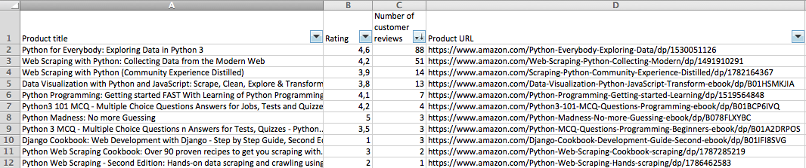

# amazon-scraper-python

# Description

This package allows you to search for products on [Amazon](https://www.amazon.com/) and extract some useful information (ratings, number of comments).

I wrote a French blog post about it [here](https://www.tducret.com/scraping/2018/06/05/amazon2csv-ou-comment-filtrer-les-produits-d-amazon-dans-excel.html)

# Requirements

- Python 3
- pip3

# Installation

```bash
pip3 install -U amazonscraper
```

# Command line tool `amazon2csv.py`

After the package installation, you can use the `amazon2csv.py` command in the terminal.

After passing a search request to the command (and an optional maximum number of products), it will return the results as csv :

```bash
amazon2csv.py --keywords="Python programming" --maxproductnb=2
```

```csv
Product title,Rating,Number of customer reviews,Product URL
"Python Crash Course: A Hands-On, Project-Based Introduction to Programming",4.5,309,https://www.amazon.com/Python-Crash-Course-Hands-Project-Based/dp/1593276036
"A Smarter Way to Learn Python: Learn it faster. Remember it longer.",4.8,144,https://www.amazon.com/Smarter-Way-Learn-Python-Remember-ebook/dp/B077Z55G3B
```

You can also pass a search url (if you added complex filters for example), and save it to a file :

```bash
amazon2csv.py --url="https://www.amazon.com/s/ref=nb_sb_noss_2?url=search-alias%3Daps&field-keywords=python+scraping" > output.csv
```

You can then open it with your favorite spreadsheet editor (and play with the filters) :



More info about the command in the help :

```bash
amazon2csv.py --help
```

# Using the `amazonscraper` Python package

```python
# -*- coding: utf-8 -*-
import amazonscraper

results = amazonscraper.search("Python programming")

for result in results:
    print("%s (%s out of 5 stars, %s customer reviews) :  %s" % (result.title, result.rating, result.review_nb, result.url))

print("Number of results : %d" % (len(results)))

```

Which will output :

```
Learning Python, 5th Edition (4.0 out of 5 stars, 293 customer reviews) : https://www.amazon.com/Learning-Python-5th-Mark-Lutz/dp/1449355730
Fluent Python: Clear, Concise, and Effective Programming (4.6 out of 5 stars, 87 customer reviews) : https://www.amazon.com/Fluent-Python-Concise-Effective-Programming/dp/1491946008
[...]
Number of results : 3000
```

### Attributes of the `Product` object

Attribute name      | Description
------------------- | ---------------------------------------
title               | Product title
rating      	    | Rating of the products (number between 0 and 5, False if missing)
review_nb	        | Number of customer reviews (False if missing)
url 				| Product URL

--------------

## TODO

- [ ] If no product was found with the CSS selectors, it may be a new Amazon page style => change user agent and get the new page. Loop on all the user agents and check all the CSS selectors again
- [ ] Find a way to get the products without css selectors